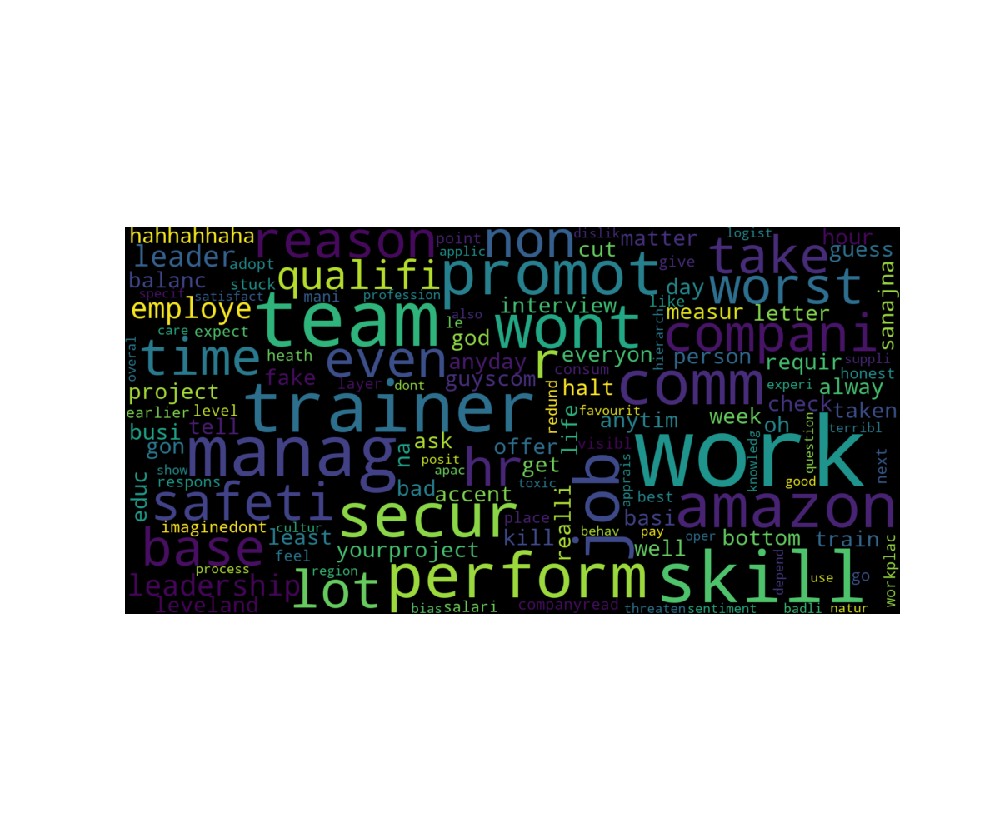

| Name | work_life_balance | skill_development | salary_and_benefits | job_security | career_growth | work_satisfaction | Overall_rating |
|----------------------------------------|-------------------|-------------------|---------------------|--------------|---------------|-------------------|----------------|
| Software Development Engineer | 1.0 | 2.0 | 5.0 | 1.0 | 3.0 | 3.0 | 2.0 |
| Dls Case Specialist II HR Assistant | 5.0 | 1.0 | 3.0 | 1.0 | 2.0 | 1.0 | 1.0 |
| Customer Support Associate (working remotely) | 2.0 | 1.0 | 2.0 | 1.0 | 2.0 | 3.0 | 1.0 |
| Sds Associate (working remotely) | 3.0 | 2.0 | 2.0 | 2.0 | 2.0 | 2.0 | 2.0 |
| Software Developer | 3.0 | 4.0 | 5.0 | 3.0 | 4.0 | 3.0 | 4.0 |
| Senior Associate -Supply Chain Operations-forecast And Operational Planning | 2.0 | 1.0 | 4.0 | 4.0 | 4.0 | 1.0 | 3.0 |
| Regional Manager Ehs | 2.0 | 3.0 | 3.0 | 2.0 | 2.0 | 2.0 | 2.0 |
| Associate Executive | 2.0 | 1.0 | 2.0 | 1.0 | 1.0 | 1.0 | 1.0 |
| Process Associate | 4.0 | 5.0 | 4.0 | 5.0 | 5.0 | 5.0 | 5.0 |
| Manager | 2.0 | 3.0 | 5.0 | 1.0 | 3.0 | 2.0 | 3.0 |

## Likes

## Dislikes

